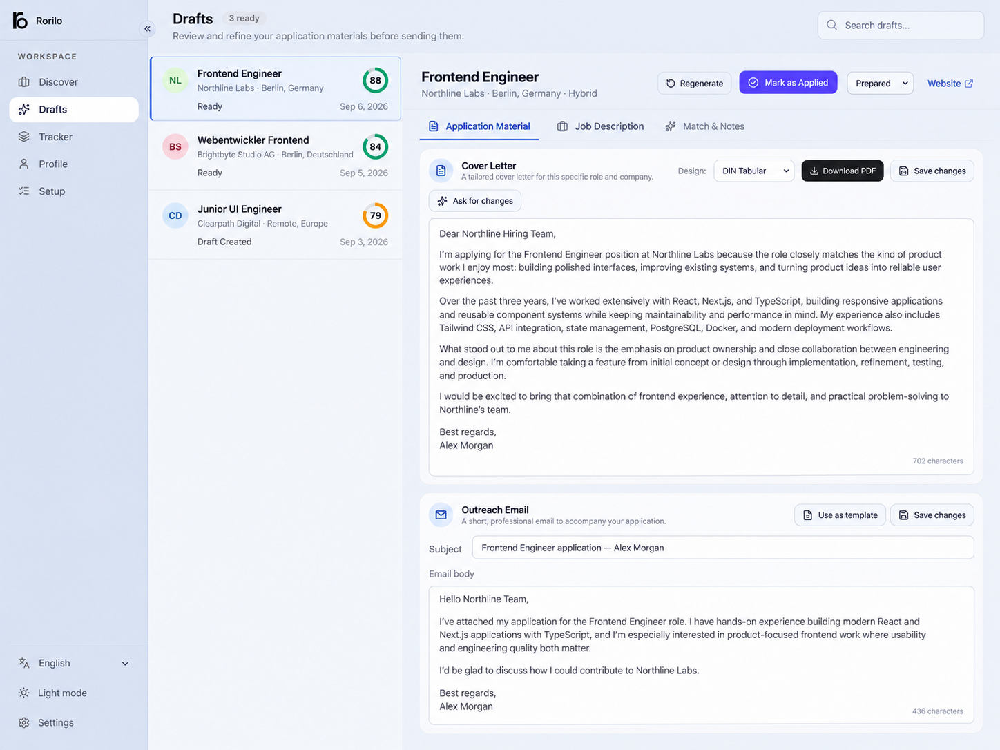
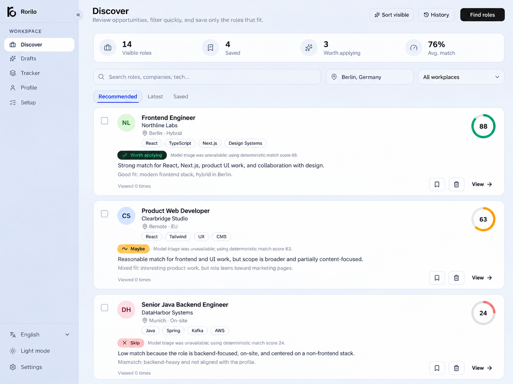
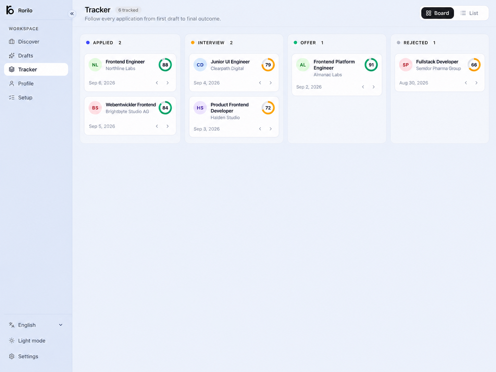

# Rorilo

**Local-first AI job search and application assistant.**

Rorilo helps you discover jobs across multiple sources, evaluate how well they match your profile, generate tailored cover letters and recruiter emails, and track every application from one place.

Your profile, jobs, drafts, and settings stay on your machine. Rorilo does not blindly auto-apply: it handles the repetitive research and preparation while you decide what gets submitted.

<details>
<summary>Table of contents</summary>

- [Screenshots](#screenshots)
- [Download](#download)
- [Features](#features)
- [How it works](#how-it-works)
- [Job sources](#job-sources)
- [Privacy](#privacy)
- [Code Signing Policy](#code-signing-policy)
- [Docker](#docker)
- [Development from source](#development-from-source)
- [Environment variables](#environment-variables)
- [Project structure](#project-structure)
- [Contributing](#contributing)
- [Getting the best results](#getting-the-best-results)
- [Current limitations](#current-limitations)
- [License](#license)

</details>

## Screenshots







## Download

Desktop builds are available from the [latest GitHub release](https://github.com/ubaimutl/Rorilo/releases/latest).

| Platform            | Package                    |
| ------------------- | -------------------------- |
| Windows             | `.exe` installer or `.msi` |
| macOS Apple Silicon | `aarch64.dmg`              |
| macOS Intel         | `x64.dmg`                  |
| Linux               | `.AppImage`                |

The desktop app includes the local runtime and database setup. You do **not** need Node.js, npm, Docker, or a separate database server to use the desktop build.

## Features

- Discover jobs across multiple public sources, ATS boards, and optional Apify actors.
- Score and triage roles as **Worth applying**, **Maybe**, or **Skip** using your actual profile and preferences.
- Generate grounded cover letters, recruiter emails, and screening-question answers without inventing experience.
- Explain strong matches, missing skills, and potential issues for each role.
- Deduplicate repeated listings and remember jobs you already removed.
- Export application materials as styled PDFs.
- Create Gmail drafts for review before sending.
- Track applications through applied, interview, offer, rejection, and archive states.
- Use any supported OpenAI-compatible AI provider.
- Keep your core data in a local SQLite database.

## How it works

1. Configure an AI provider.
2. Upload or paste your CV.
3. Fill in your profile and job preferences.
4. Choose the job sources you want to use.
5. Review discovered jobs and remove anything irrelevant.
6. Prepare application material for jobs worth applying to.
7. Submit applications yourself and track their progress in Rorilo.

The setup wizard handles the initial configuration, and everything can be changed later from Settings.

## Job sources

Rorilo supports several source types so you are not locked to one job platform.

### Free and public sources

Built-in sources can be enabled from Settings or the search dialog. Some require no account at all, while others such as Adzuna or Techmap use optional free API credentials.

### Apify

Apify is optional and useful for sources such as LinkedIn, Indeed, StepStone, or custom Actors. Multiple Actors can be saved and selected per search.

### Company career boards

Rorilo can search public Greenhouse, Lever, Ashby, and Personio boards. You can add the companies you care about without depending on a separate job aggregator.

## Privacy

Rorilo is designed as a single-user, local-first application.

Your CV text, profile, search history, job data, generated drafts, and settings are stored in a local SQLite database. External calls happen only when required by integrations you choose to enable, such as:

- your configured AI provider
- job-search sources
- Apify Actors
- Logo.dev for company logos
- Gmail for draft creation

Rorilo does not submit job applications automatically.

## Code Signing Policy

Windows release builds may be signed through [SignPath.io](https://signpath.io/), with the code signing certificate provided by the SignPath Foundation for open source projects.

Signing is used only to identify official Rorilo Windows binaries that were produced from this public repository and its GitHub Actions release workflow. It does not change the application's local-first privacy model.

Project roles:

- Committers maintain the source code and submit changes through the public GitHub repository.
- Reviewers check code, packaging, and release changes before they are accepted.
- Approvers authorize signing requests and release publication after verifying that the artifacts come from the expected GitHub Actions workflow.

Rorilo stores profile data, CV text, job data, settings, and generated drafts locally on the user's machine. External network requests happen only for integrations the user configures, such as an AI provider, job sources, Apify, Logo.dev, or Gmail draft creation.

## Docker

For self-hosting or server use, a Docker image is also published.

```bash
docker run --rm -p 3000:3000 \
  -v rorilo-data:/data \
  ghcr.io/ubaimutl/rorilo:latest
```

Or use Compose:

```bash
docker compose up -d
```

The container stores the SQLite database in `/data/rorilo.db`. Keep the volume if you want to preserve your profile, settings, jobs, and drafts.

## Development from source

Requirements:

- Node.js 22 or newer
- npm

```bash
git clone https://github.com/ubaimutl/Rorilo.git rorilo
cd rorilo
npm install
cp .env.example .env
npx prisma db push
npm run dev
```

Open `http://localhost:3000`.

Most keys can be entered directly in the app, so `.env` can stay minimal for local development.

### Useful commands

```bash
npm run dev
npm run lint
npm run test
npm run build
npm run desktop:build
```

Database changes during development:

```bash
npx prisma db push
```

## Environment variables

| Variable               | Required | Purpose                                                                   |
| ---------------------- | -------- | ------------------------------------------------------------------------- |
| `DATABASE_URL`         | yes      | Prisma database connection. Defaults to local SQLite in `.env.example`.   |
| `RORILO_AUTH_SECRET`   | no       | Enables Basic Auth for hosted deployments when set.                       |
| `RORILO_AUTH_USER`     | no       | Optional Basic Auth username. Defaults to `rorilo`.                       |
| `AI_BASE_URL`          | no       | OpenAI-compatible API base URL.                                           |
| `AI_API_KEY`           | no       | Model provider key. Can also be saved from Settings.                      |
| `AI_MODEL`             | no       | Default model name.                                                       |
| `APIFY_TOKEN`          | no       | Enables Apify-based job search.                                           |
| `APIFY_ACTOR_ID`       | no       | Optional default Apify Actor. Multiple Actors can be managed in Settings. |
| `ADZUNA_APP_ID`        | no       | Enables Adzuna search.                                                    |
| `ADZUNA_APP_KEY`       | no       | Enables Adzuna search.                                                    |
| `TECHMAP_API_KEY`      | no       | Enables Techmap search.                                                   |
| `LOGO_DEV_TOKEN`       | no       | Logo.dev publishable key for company logos.                               |
| `GOOGLE_CLIENT_ID`     | no       | Gmail draft integration.                                                  |
| `GOOGLE_CLIENT_SECRET` | no       | Gmail draft integration.                                                  |
| `GOOGLE_REDIRECT_URI`  | no       | OAuth callback URL for Gmail integration.                                 |

## Project structure

```text
app/                 Next.js pages and API routes
components/          React components and UI primitives
lib/ai/              OpenAI-compatible provider client and model helpers
lib/application/     Cover letter, email, and Q&A generation
lib/cv/              CV parsing and profile extraction
lib/job-sources/     Free sources, Apify adapters, ATS board search
lib/jobs/            Normalization, dedupe, exclusions, triage, history
lib/matching/        Deterministic scoring engine
lib/pdf/             PDF export
prisma/              Database schema
src-tauri/           Desktop shell and bundled local runtime
tests/               Vitest tests
```

## Contributing

Contributions are welcome, especially for:

- job sources for additional countries and regions
- public ATS and career-board integrations
- source reliability improvements
- desktop packaging and platform fixes
- accessibility and UX improvements

Please keep integrations modular and normalize discovered jobs through Rorilo's existing job-source interfaces.

## Getting the best results

Rorilo's results depend heavily on the AI provider you choose and the profile you set up. Spend a few minutes adding a clear CV, target roles, skills, locations, salary expectations, writing style, and notes. Better profile data produces better matches and better drafts.

**Recommended model: `gpt-5.4-mini`.** In testing, it has produced the most reliable results for Rorilo's mix of job analysis, structured matching, cover-letter generation, and recruiter emails. Other OpenAI-compatible models can be used, but results may vary significantly.

Smaller local or very cheap models can work, but they may return weaker matches, invalid structured output, or less polished application material.

## Current limitations

- Rorilo prepares applications but does not submit forms on external career sites.
- Scrapers and third-party APIs can change without warning.
- The app is currently designed for one user on one machine.
- Generated application material should always be reviewed before sending.

## License

Rorilo is released under the [MIT License](LICENSE).
